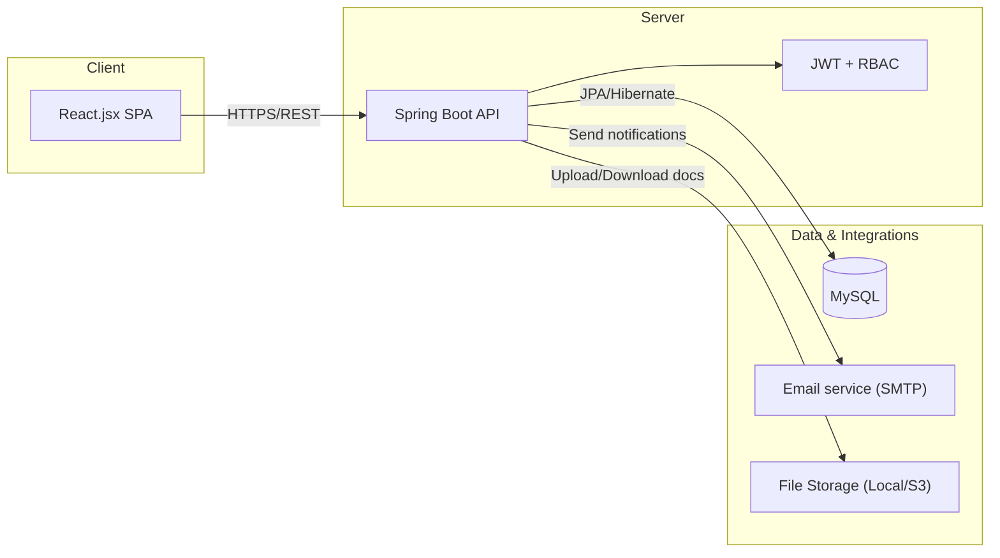
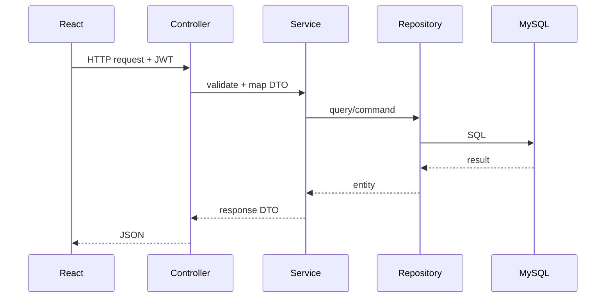

# Architecture Design

**Dự án:** Hệ thống quản lý thực tập sinh (Internship Management System - IMS)  
**Tech stack:** Spring Boot (Backend) · React.jsx (Frontend) · MySQL (Database)  

## 1. Mục tiêu kiến trúc
- Tách lớp rõ ràng (presentation/service/domain/data) để dễ mở rộng theo backlog.
- API chuẩn REST, dễ tích hợp thông báo/email và các hệ thống HR khác.
- Bảo mật theo vai trò (RBAC) cho 4 nhóm người dùng: **Admin / HR / Mentor / Thực tập sinh**.

## 2. Kiến trúc tổng quan (Container)

## 3. Backend (Spring Boot) - Layered Architecture
**Package gợi ý**
- `controller` (REST Controllers)
- `service` (Business logic)
- `domain` (Entities, enums)
- `repository` (Spring Data JPA)
- `security` (JWT filters, RBAC)
- `dto` (Request/Response)
- `mapper` (MapStruct hoặc manual)
- `exception` (Global handler)
- `config` (CORS, Swagger/OpenAPI, Flyway)

**Luồng request**

## 4. Frontend (React.jsx) - Cấu trúc đề xuất
- `src/pages` (màn hình theo route)
- `src/components` (UI components)
- `src/api` (axios client, interceptors)
- `src/store` (Redux/Zustand nếu cần)
- `src/hooks` (custom hooks)
- `src/utils` (helpers, constants)
- `src/styles` (Tailwind/CSS)

**Đề xuất routing**
- `/login`
- `/dashboard`
- `/interns` (HR)
- `/applications` (HR)
- `/my-profile` (Intern)
- `/mentor/tasks` (Mentor)
- `/admin/users` (Admin)

## 5. Tích hợp & cross-cutting
- **Auth:** JWT (access token) + refresh token (tuỳ chọn).
- **RBAC:** Role/Permission kiểm soát endpoint & UI.
- **Validation:** Bean Validation (Jakarta Validation) + message i18n.
- **Observability:** logback + request id; có thể thêm Prometheus/Grafana sau.
- **API docs:** OpenAPI/Swagger.

## 6. Chiến lược triển khai
- Dev: FE chạy `localhost:5173` (Vite) / BE `localhost:8080` / DB local.
- Prod (gợi ý): Nginx serve FE + reverse proxy `/api` → Spring Boot, DB tách riêng.
