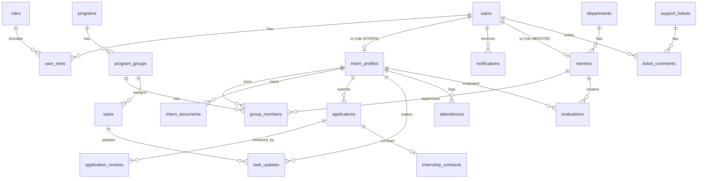

# Database Structure

**Dự án:** Hệ thống quản lý thực tập sinh (Internship Management System - IMS)  
**DB:** MySQL (thiết kế & thao tác bằng MySQL Workbench)

## 1. Quy ước
- Tên bảng: `snake_case` số nhiều (ví dụ: `intern_profiles`)
- PK: `id` (BIGINT auto increment)
- FK: `<entity>_id`
- Thời gian: `created_at`, `updated_at` (DATETIME)

## 2. ERD (gợi ý)

## 3. Danh sách bảng chính (MVP)
### 3.1 Auth & Admin
- `users`(id, email, password_hash, full_name, phone, status, created_at, updated_at)
- `roles`(id, code, name)
- `user_roles`(user_id, role_id) PK(user_id, role_id)

### 3.2 Thực tập sinh & hồ sơ
- `intern_profiles`(id, user_id UNIQUE, dob, university, major, address, start_date, end_date, ... )
- `intern_documents`(id, intern_id, type, file_url, status, uploaded_at, reviewed_by, reviewed_at)

### 3.3 Tiếp nhận & xét duyệt
- `applications`(id, intern_id, position, applied_at, status, note)
- `application_reviews`(id, application_id, reviewer_id, decision, comment, decided_at)
- `internship_contracts`(id, application_id UNIQUE, file_url, signed_at, status)

### 3.4 Chương trình & nhóm
- `programs`(id, name, description, start_date, end_date, status)
- `program_groups`(id, program_id, name, department_id, mentor_id, status)
- `group_members`(id, group_id, intern_id, joined_at, left_at)

### 3.5 Công việc & đánh giá
- `tasks`(id, group_id, title, description, due_date, status, created_by)
- `task_updates`(id, task_id, intern_id, progress_percent, content, created_at)
- `evaluations`(id, intern_id, mentor_id, period, score, comment, created_at)

### 3.6 Chấm công & thời gian
- `attendances`(id, intern_id, date, check_in, check_out, total_minutes, note)

### 3.7 Hỗ trợ & thông báo
- `support_tickets`(id, created_by, category, title, content, status, created_at)
- `ticket_comments`(id, ticket_id, author_id, content, created_at)
- `notifications`(id, user_id, type, title, content, is_read, created_at)

## 4. Index & ràng buộc (gợi ý)
- `users.email` UNIQUE
- `intern_profiles.user_id` UNIQUE
- Index cho các cột filter: `applications.status`, `tasks.status`, `attendances.date`, `programs.status`
- FK ON DELETE:
  - `intern_documents.intern_id` → CASCADE
  - `task_updates.task_id` → CASCADE

## 5. Migration
Khuyến nghị dùng **Flyway** (`V1__init.sql`, `V2__add_tasks.sql`...) để đồng bộ DB giữa các môi trường.
