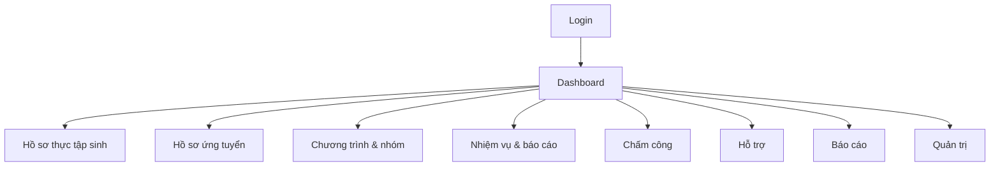

# Screen Design

**Dự án:** Hệ thống quản lý thực tập sinh (Internship Management System - IMS)

## 1. Sitemap (gợi ý)

## 2. Màn hình theo vai trò
### 2.1 Thực tập sinh
- Đăng ký / Đăng nhập
- Hồ sơ cá nhân (view/update)
- Upload tài liệu (CV, đơn xin…)
- Theo dõi kết quả xét duyệt + hợp đồng
- Xem lịch thực tập, lịch nhóm
- Danh sách nhiệm vụ, cập nhật tiến độ, nộp báo cáo tuần
- Chấm công (check-in/out)
- Gửi yêu cầu hỗ trợ / xem phản hồi
- Thông báo

### 2.2 HR
- Danh sách thực tập sinh (CRUD, search/filter)
- Duyệt hồ sơ, gửi email thông báo kết quả
- Quản lý hợp đồng (upload, theo dõi ký)
- Quản lý chương trình thực tập, tạo nhóm, gán mentor
- Tổng hợp đánh giá và xuất báo cáo
- Thống kê theo chương trình/kỳ

### 2.3 Mentor
- Danh sách nhóm thực tập sinh
- Giao nhiệm vụ, xem tiến độ
- Nhận & phản hồi báo cáo tuần
- Đánh giá định kỳ

### 2.4 Admin
- Quản lý user/role/permission
- Cấu hình hệ thống (email, storage)
- Theo dõi log/audit (tuỳ chọn)

## 3. Mô tả wireframe mức chức năng (text)
### 3.1 Danh sách thực tập sinh (HR) `/interns`
- Bộ lọc: trạng thái, chương trình, phòng ban, keyword
- Bảng: mã, họ tên, email, trường, mentor, trạng thái, hành động
- Hành động: xem chi tiết, sửa, khoá/mở, export

### 3.2 Form thêm mới thực tập sinh (HR) `/interns/new`
- Section Thông tin cơ bản: họ tên, email, phone, trường, chuyên ngành
- Section Thực tập: ngày bắt đầu/kết thúc, chương trình, nhóm, mentor
- Validate: bắt buộc email unique, ngày hợp lệ

### 3.3 Nhiệm vụ (Mentor) `/mentor/tasks`
- Tạo nhiệm vụ: tiêu đề, mô tả, deadline, gán cho nhóm/TTs
- Theo dõi tiến độ: % + comment + file đính kèm (tuỳ chọn)

## 4. Mapping route ↔ API (gợi ý)
- `/interns` ↔ `GET /api/interns`
- `/interns/new` ↔ `POST /api/interns`
- `/applications` ↔ `GET /api/applications`
- `/mentor/tasks` ↔ `POST /api/tasks`, `GET /api/tasks?groupId=...`
