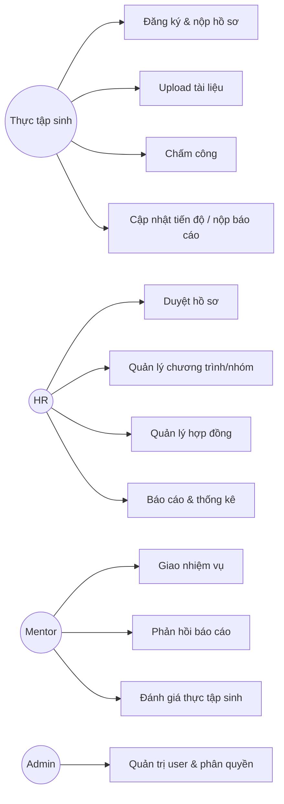

# System Analysis

**Dự án:** Hệ thống quản lý thực tập sinh (Internship Management System - IMS)

## 1. Bài toán
Doanh nghiệp cần một hệ thống thống nhất để quản lý tuyển thực tập sinh và vận hành chương trình thực tập (workflow, giao việc, theo dõi, đánh giá, báo cáo).

## 2. Actors
- Admin
- HR
- Mentor
- Thực tập sinh
- External systems (Email/Notification service)

## 3. Use cases chính

## 4. Workflow (state machine gợi ý)
### 4.1 Ứng tuyển (Application)
- `DRAFT` → `SUBMITTED` → (`APPROVED` | `REJECTED`) → `CONTRACT_SENT` → `CONTRACT_SIGNED`

### 4.2 Nhiệm vụ (Task)
- `OPEN` → `IN_PROGRESS` → `SUBMITTED` → (`APPROVED` | `NEEDS_CHANGES`) → `DONE`

## 5. Data objects chính
- User, Role, Permission
- InternProfile, Document
- Application, Review, Contract
- Program, Group, Membership
- Task, TaskUpdate, WeeklyReport (có thể gộp)
- Attendance
- Evaluation
- Notification, SupportTicket

## 6. Rủi ro & giả định
- Email SMTP/credentials có sẵn (hoặc dùng service nội bộ).
- Lưu file: giai đoạn đầu có thể lưu local; production chuyển S3/MinIO.
- Quy trình duyệt hồ sơ có thể thay đổi, nên thiết kế theo trạng thái + audit.
